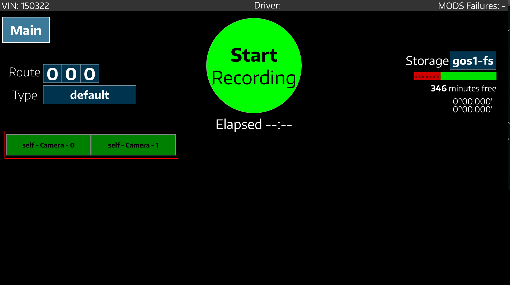
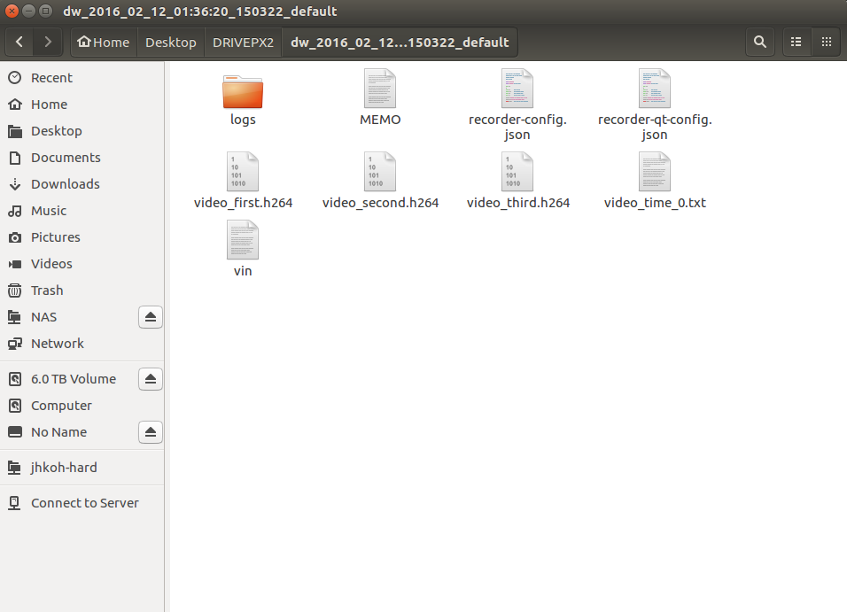
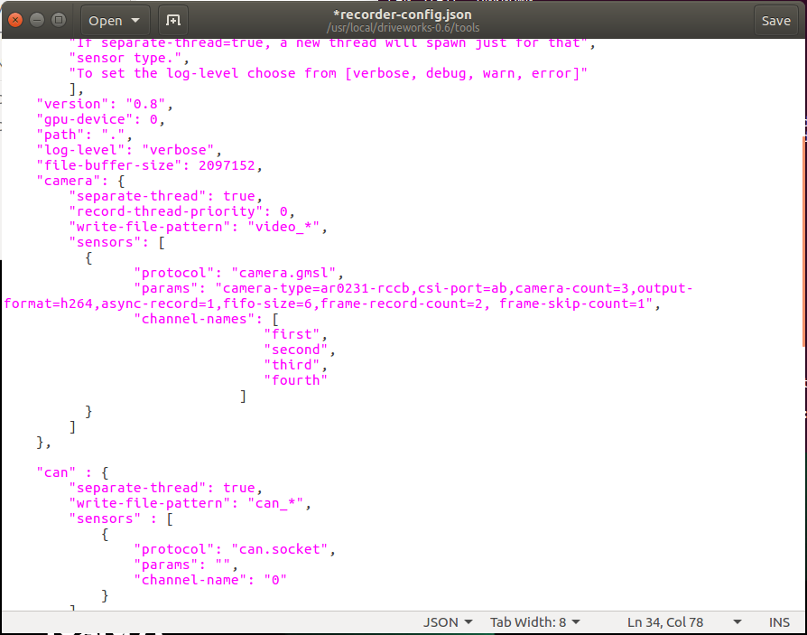
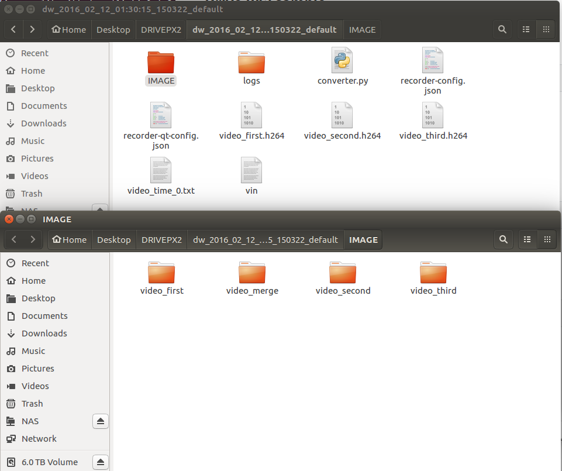
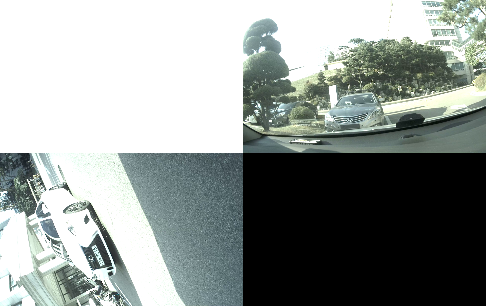

## Drive PX2 Logging tool 사용법


### Drive PX2 logging tool

- recorder-qt

  - logging tool은 /usr/local/driveworks/tools/recorder-qt 에 위치해있다

  - ```
    $ sudo /usr/local/driveworks/tools/recorder-qt
    ```

    

  - 위 그림의 빨간 박스처럼 self-camera-0, self-camera-1이 떠있으면 두개의 카메라로 로깅이 가능한 상태이다. 떠있지 않으면 제대로 연결이 안되어서 로깅이 불가한 상태이므로 연결을 확인해보아야 한다. 

  - **Start Recording**을 누르면 로깅이 시작된다

  - **Stop Recording**을 누르면 로깅이 끝난다

  - /usr/local/driveworks/tools/ 디렉토리에 현재시간을 폴더명으로한 폴더가 만들어지고 폴더 내에는 gmsl카메라 각각의 h264파일, recorder-config.json, recorder-qt-config.json 그리고 타임스탬프가 적혀있는 video_time_0.txt가 저장된다

  - 

- recorder-qt 설정

  - recorder-qt의 환경을 변경하기 위해서는 /usr/local/driveworks/tools/recorder-config.json 파일을 변경해야한다

    ```
    $ sudo gedit /usr/local/driveworks/tools/recorder-config.json 
    ```

    

  - --csi-port:               Port A: ab, Port B: cd, Port C: ef

  - --camera-count:   포트에 몇개의 카메라를 연결했는지

  - --output-format:  raw, h264 고를수있음 h264가 압축포맷이어서 훨씬 용량이 작아서 h264로 이용

  - FPS 설정

    - default: 30 FPS
    - frame-record-count만큼 frame저장하고 frame-skip-count만큼 스킵한다
    - ex) frame-record-count=1, frame-skip-count=1: 15 FPS
    - ​      frame-record-count=2, frame-skip-count=1: 20 FPS
    - ​      frame-record-count=1, frame-skip-count=2: 10 FPS


### Drive PX2 sample 

- sample_camera_gmsl

  - 0번 포트에 연결되어있는 gmsl카메라를 실행해볼 수 있다

  ```
  $ sudo /usr/local/driveworks/bin/sample_camera_gmsl
  ```

- sample_camera_multiple_gmsl

  - 포트에 연결되어있는 multiple gmsl카메라를 실행해 볼 수 있다

  - --selector-mask
    - 포트 0번 1번 연결되어있으면 		--selector-mask=0011
    - 포트 0번 1번 2번 연결되어있으면   --selector-mask=0111
  ```
  $ sudo ./sample_camera_multiple_gmsl --selector-mask=0111
  ```

- sample_camera_replay

  - 로깅된 h264파일을 실행해 볼 수 있다

  - --video: 파일주소

  ```
  $ sudo ./sample_camera_replay --video=/usr/local/driveworks/~~~~.h264
  ```

- sample_camera_gmsl_raw

  - 포트의 0번에 꽂혀진 카메라로 raw파일이나 h264파일으로 저장할 수 있다


### H264 parsing python script

- 

- 로깅된 폴더에 converter.py를 넣고 --num 인자에 카메라 개수를 넘겨준다. default는 1이다

- ```
  $ python3 converter.py --num=3
  ```

  IMAGE폴더에 h264파일 각각에서 파싱된 이미지와 merge된 이미지 폴더가 만들어진다 merge된 이미지는 다음과 같다

